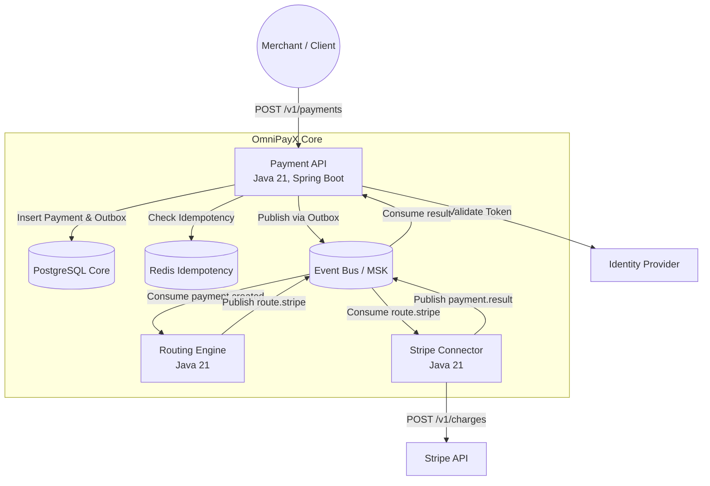
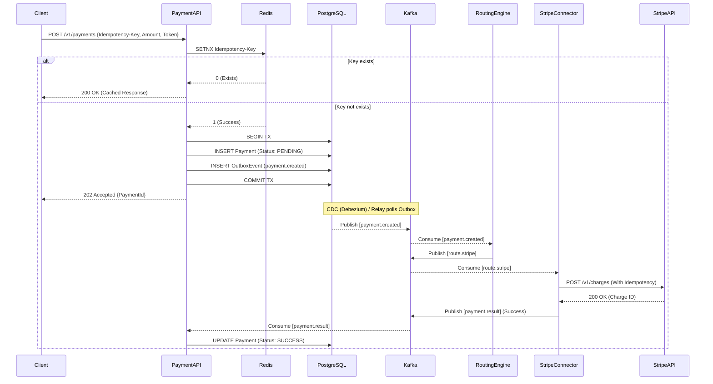
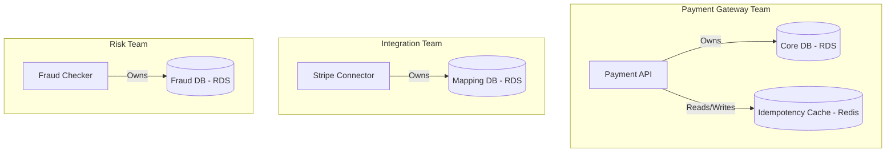
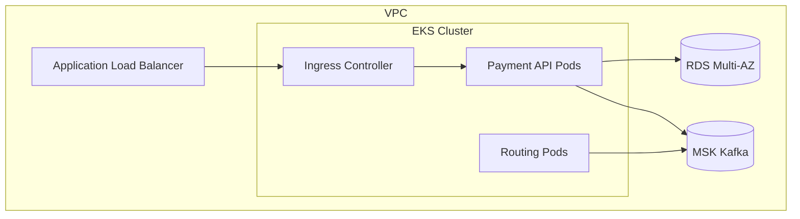

# 01-OmniPayX: Global Payment Gateway

**Tagline:** High-performance, highly available payment routing and reconciliation engine.
**Ngôn ngữ:** Java 21+
**Cloud:** AWS (Amazon Web Services)
**Architecture Style:** Microservices (Event-Driven)
**System Type:** Production System

## 1. Overview & Outcomes

OmniPayX là một cổng thanh toán toàn cầu (Global Payment Gateway) được thiết kế để xử lý hàng vạn giao dịch mỗi giây. Vấn đề cốt lõi mà hệ thống giải quyết là đảm bảo tính toàn vẹn của dữ liệu tài chính (không double-charge) và khả năng tích hợp linh hoạt với nhiều nhà cung cấp cổng thanh toán khác nhau (Stripe, PayPal, nội địa) trong môi trường có độ trễ thay đổi. Hệ thống được thiết kế cho quy mô tổ chức có nhiều team kỹ thuật chuyên biệt, vận hành độc lập theo domain.

### Traffic Profile
- **Peak Write Traffic:** 10,000 TPS vào các dịp lễ (Black Friday, Cyber Monday).
- **Steady Write Traffic:** ~2,000 TPS.
- **R/W Mix:** 20% Read / 80% Write (Chủ yếu là tạo và cập nhật trạng thái giao dịch).
- **Payload:** Trung bình 2KB - 5KB cho mỗi request thanh toán (chứa thông tin giỏ hàng, user, token mã hóa).
- **Concurrent Sessions:** ~50,000 active connections tại edge.

### Production Posture
Hệ thống là Tier-1 Core System, liên quan trực tiếp đến doanh thu của toàn bộ tổ chức. Bất kỳ gián đoạn nào cũng gây thiệt hại tài chính nghiêm trọng. Do đó, OmniPayX đòi hỏi một tư duy vận hành (operability) cực kỳ cao: giám sát theo thời gian thực, cảnh báo tự động, có khả năng failover nhanh chóng, và cơ chế on-call 24/7. Tổ chức yêu cầu các service phải được phân chia ownership rõ ràng để giảm thiểu blast radius khi có sự cố.

### Team Ownership

| Team | Mission | Owns services | On-call rotation | Escalation |
|---|---|---|---|---|
| **Payment Gateway Team** | Quản lý API, định tuyến giao dịch và Core Payment logic. | `payment-api`, `routing-engine` | 24/7 (Primary) | L3 Engineering Manager |
| **Bank Integration Team** | Quản lý kết nối, adapter với các đối tác thanh toán bên ngoài. | `stripe-connector`, `paypal-connector` | 24/7 (Secondary) | Partner Integration Lead |
| **Risk & Fraud Team** | Đánh giá rủi ro, chặn giao dịch bất thường theo thời gian thực. | `fraud-checker`, `risk-rules-engine` | Business Hours | Risk Operations |
| **Platform SRE Team** | Quản lý hạ tầng AWS, Kubernetes, CI/CD, Observability. | EKS, MSK, Terraform Modules | 24/7 (Infra) | Head of Platform |

### Learning Outcomes
- **Java 21 Virtual Threads:** Tối ưu hóa I/O bound tasks khi gọi external APIs mà không tốn chi phí OS threads.
- **Distributed Transactions:** Xử lý tính nhất quán dữ liệu bằng Outbox Pattern và Idempotency.
- **EKS Ecosystem:** Vận hành microservices quy mô lớn trên Kubernetes.

### Non-Goals
- Không xây dựng UI/Frontend cho End-User (chỉ cung cấp API).
- Không tự lưu trữ thông tin thẻ tín dụng (PCI-DSS PAN data) ở dạng raw, hệ thống giả định đã nhận tokenized data từ client/provider.
- Không xây dựng hệ thống đối soát (Reconciliation) hàng loạt ban đêm trong scope của dự án này (thuộc dự án khác).

---

## 2. Architecture at a Glance

Kiến trúc **Microservices** kết hợp **Event-Driven** được chọn để chia tách logic xử lý thanh toán cốt lõi khỏi logic kết nối ngân hàng. Phương án này (so với Monolith) cho phép Bank Integration Team có thể deploy các connector mới liên tục mà không ảnh hưởng đến uptime của Payment Gateway. Điểm trade-off là tăng độ phức tạp trong việc quản lý phân tán (tracing, transaction).

### Bảng Services

| Service | Team | Responsibility | Sync APIs | Async consume/produce | Data owned | Scaling unit | SLO |
|---|---|---|---|---|---|---|---|
| **payment-api** | Gateway Team | Edge service nhận request, xác thực, phân giải token, rate limit. | REST, gRPC | Produce: `payment.created` | Request Log | Pod (CPU) | 99.99% |
| **routing-engine** | Gateway Team | Quyết định connector nào xử lý dựa trên rule (phí, loại thẻ, region). | gRPC | Consume: `payment.created` | Routing Rules | Pod (CPU) | 99.99% |
| **stripe-connector** | Integration Team | Gọi Stripe API, xử lý timeout, retry, idempotency với Stripe. | REST (to Stripe)| Consume: `route.stripe`, Produce: `payment.result`| Stripe Tx Mapping| Pod (Network)| 99.95% |
| **fraud-checker** | Risk Team | Đánh giá rủi ro giao dịch (ML model hoặc rule engine). | gRPC | Consume: `payment.created` | Fraud Scores | Pod (Memory) | 99.9% |

### Bảng Components

| Component | Type | Responsibility | Phụ thuộc |
|---|---|---|---|
| **Idempotency Filter** | Shared Lib (Java) | Chặn các request lặp lại có cùng Idempotency-Key trong vòng 24h. | Redis |
| **Outbox Relay** | CDC Engine | Đọc bảng outbox trong PostgreSQL và push event lên Kafka (vd: Debezium). | PostgreSQL, Kafka |
| **API Gateway** | AWS ALB / Ingress | SSL Termination, WAF, cơ chế chặn DDoS lớp 7. | AWS WAF |

### Folder Map (DevOps Focus)

```text
01-omnipayx/
├── payment-api/
│   ├── src/main/java/...
│   ├── Dockerfile
│   └── k8s/deployment.yaml
├── routing-engine/
│   ├── src/main/java/...
│   ├── Dockerfile
│   └── k8s/deployment.yaml
├── stripe-connector/
│   ├── src/main/java/...
│   ├── Dockerfile
│   └── k8s/deployment.yaml
├── shared-libs/
│   └── idempotency-starter/
├── docker-compose.yml              # Local Dev deps (Postgres, Redis, Kafka, Zookeeper)
├── docker-compose.override.yml
├── infra/terraform/
│   ├── modules/
│   │   ├── vpc/
│   │   ├── eks/
│   │   ├── rds/
│   │   ├── elasticache/
│   │   └── msk/
│   ├── envs/
│   │   ├── staging/
│   │   └── prod/
├── deploy/
│   └── helm/                       # Helm charts cho EKS deployment
└── .github/
    └── workflows/
        ├── ci-payment-api.yml
        ├── ci-routing-engine.yml
        ├── cd-staging.yml
        └── cd-prod.yml
```

### Dependency Rules
- `payment-api` là edge, chỉ gọi downstream qua gRPC hoặc push event, không được bị gọi ngược lại.
- Các connector không được giao tiếp với nhau.
- Mọi giao tiếp ghi trạng thái thanh toán đều phải qua Kafka (Event-Driven) để đảm bảo không mất dữ liệu khi gián đoạn mạng.

---

## 3. System Topology & Scale

### 3.1. C4 / Container Diagram (Services & Stores)


*Chú thích: Biểu đồ C4 thể hiện các luồng giao tiếp giữa client, hệ thống nội bộ và các provider bên ngoài. Các database và event bus đóng vai trò là xương sống kết nối.*

### 3.2. Detailed Request Flow (Happy Path)


*Chú thích: Request flow tập trung vào tính bất đồng bộ. Client nhận 202 Accepted ngay khi record được lưu vào database. Các bước xử lý với Bank diễn ra ngầm thông qua Kafka và Outbox pattern.*

### 3.3. Idempotency & Storage Ownership


*Chú thích: Mỗi domain team sở hữu cơ sở dữ liệu riêng, tránh tình trạng shared database gây thắt cổ chai và coupling.*

### 3.4. Multi-Region HA & Failover

```mermaid
graph TD
    Client((Client)) --> R53[Route 53 (Latency Based Routing)]
    R53 -->|Region A (us-east-1)| WAF_A[AWS WAF]
    R53 -->|Region B (us-west-2)| WAF_B[AWS WAF]
    
    subgraph Region A (Active)
        WAF_A --> ALB_A[ALB]
        ALB_A --> EKS_A[EKS Cluster A]
        EKS_A --> RDS_A[(RDS Primary)]
    end
    
    subgraph Region B (Active/Standby)
        WAF_B --> ALB_B[ALB]
        ALB_B --> EKS_B[EKS Cluster B]
        EKS_B --> RDS_B[(RDS Read Replica)]
    end
    
    RDS_A -.->|Cross-Region Replication| RDS_B
```
*Chú thích: Mô hình Active-Standby cho Database, Active-Active cho Compute. Khi Region A sập, RDS B được thăng cấp (Promote) thành Primary.*

### 3.5. CI/CD Pipeline Flow

```mermaid
flowchart LR
    Dev([Developer]) -->|Push/PR| GitHub[GitHub Repo]
    subgraph GitHub Actions
        Build[Build (Gradle/Maven)]
        Test[Unit & Contract Tests]
        Scan[Trivy Vuln Scan]
        Image[Docker Build & Push to ECR]
    end
    GitHub --> Build --> Test --> Scan --> Image
    
    Image -->|Update Manifests| ArgoCD[ArgoCD / Helm]
    
    subgraph EKS Staging
        ArgoCD -->|Deploy| Pods_Stg[Staging Pods]
    end
    
    subgraph EKS Prod
        Gate{Manual Prod Gate}
        Pods_Stg -->|Smoke Test OK| Gate
        Gate -->|Approve| Pods_Prod[Prod Pods]
    end
```
*Chú thích: CI/CD Pipeline sử dụng GitOps với ArgoCD (hoặc quy trình Helm deploy trực tiếp qua GHA) để đảm bảo môi trường EKS luôn đồng bộ với cấu hình trong Git.*

### 3.6. AWS Compute Deploy Topology (EKS)


*Chú thích: EKS topology. ALB forward traffic vào Ingress Controller trong cụm EKS. Các service giao tiếp nội bộ qua Kubernetes Service và gọi ra RDS/MSK trong cùng VPC qua private subnets.*

### Scale Posture
- **Multi-AZ:** Bắt buộc cho EKS (chạy node trên 3 AZ), RDS Multi-AZ, MSK (3 AZ brokers).
- **Multi-Region:** Áp dụng cho Disaster Recovery. RDS cross-region replication. RTO (Recovery Time Objective): 15 phút, RPO (Recovery Point Objective): < 1 phút.

---

## 4. DDD (Domain-Driven Design)

### Bounded Contexts
| Bounded Context | Service | Trách nhiệm |
|---|---|---|
| **Payment Core** | `payment-api` | Quản lý vòng đời giao dịch thanh toán (Lifecycle). |
| **Routing** | `routing-engine` | Phân giải luật để chọn Gateway/Connector tốt nhất. |
| **Gateway Integration** | `*-connector` | Thông dịch chuẩn nội bộ sang chuẩn của nhà cung cấp. |

### Entities & Aggregates
- **PaymentCore Context:**
  - `Payment` (Aggregate Root): Thông tin thanh toán (ID, số tiền, tiền tệ, trạng thái).
  - `Transaction` (Entity): Lịch sử thay đổi trạng thái (vd: PENDING -> PROCESSING -> SUCCESS).
- **Integration Context:**
  - `GatewayLog` (Aggregate Root): Log request/response gốc từ Stripe/PayPal phục vụ tra soát.

### Consistency Strategy
- Chấp nhận **Eventual Consistency** giữa các bounded contexts.
- Trong cùng một service (ví dụ tạo Payment và ghi Outbox), sử dụng **Strong Consistency** (ACID Transaction trên RDS).
- **Idempotency:** Bắt buộc Header `Idempotency-Key` cho mọi state-changing API.

---

## 5. Storage & Data

| Store | Role | Owner | Key/Schema (Ý niệm) | Access Pattern | Consistency | Backup/Retention |
|---|---|---|---|---|---|---|
| **RDS (Core)** | Primary DB | `payment-api` | `id, merchant_id, amount, currency, status, idempotency_key, created_at` | R/W theo ID. Index trên `merchant_id` | Strong (ACID) | Automated Snapshot 30 days. |
| **ElastiCache (Redis)** | Rate Limit, Idemp | `payment-api` | `idemp:{merchant}:{key} -> status` | KV lookup tốc độ cao | Eventual/Strong | N/A (Cache) |
| **RDS (Connector)**| Mapping DB | `stripe-connector`| `internal_payment_id, stripe_charge_id, raw_response, status` | R/W mapping | Strong | 30 days |
| **MSK (Kafka)** | Event Bus | Shared | Topics: `payment.events`, `route.commands` | Sequential R/W | Eventual | 7 days retention |

**Hành vi dưới Peak Traffic:** Khi traffic tăng vọt, Kafka đóng vai trò như một buffer khổng lồ (Shock Absorber). `payment-api` tiếp tục nhận request và ghi vào DB+Outbox. Các connector sẽ consume tuỳ theo năng lực xử lý (tránh làm sập Stripe API vì Rate Limit của họ).

---

## 6. Language Mastery

- **Virtual Threads (Java 21):** Sử dụng trong các API controllers và HTTP Clients gọi external APIs. Vì các call tới ngân hàng có độ trễ cao (vài trăm ms), Virtual Threads giúp hệ thống duy trì hàng chục nghìn kết nối đồng thời mà không bị cạn kiệt OS threads, giảm thiểu memory footprint.
- **Concurrent Collections:** Sử dụng `ConcurrentHashMap` trong các cache nội bộ (in-memory) của routing rules.
- **ThreadLocal / Scoped Values:** Truyền Trace ID và Context Authentication qua các layer mà không làm bẩn method signatures, tương thích với Virtual Threads.
- **Record Classes:** Sử dụng cho các DTOs (Data Transfer Objects) immutable, giảm thiểu boilerplate code và phòng tránh lỗi thay đổi dữ liệu ngoài ý muốn.
- **Switch Expressions & Pattern Matching:** Áp dụng trong `routing-engine` để xử lý các phân nhánh logic routing phức tạp một cách an toàn và dễ đọc.

---

## 7. API & Events

### API (`payment-api`)
- Protocol: REST (JSON)
- Auth: Bearer Token (JWT)

| Method | Path | Mục đích | Auth | Idempotent? |
|---|---|---|---|---|
| POST | `/v1/payments` | Tạo giao dịch mới | Có | **Bắt buộc** (Header: `Idempotency-Key`) |
| GET | `/v1/payments/{id}` | Lấy trạng thái GD | Có | Có |
| POST | `/v1/refunds` | Hoàn tiền giao dịch | Có | **Bắt buộc** |

### Events (Kafka)
| Topic | Payload Fields (Ý niệm) | Producer | Consumers | Ordering |
|---|---|---|---|---|
| `payment.created` | `paymentId, amount, currency, merchantId` | `payment-api` | `routing-engine`, `fraud-checker` | Theo `merchantId` |
| `route.stripe` | `paymentId, routingData` | `routing-engine` | `stripe-connector` | Theo `paymentId` |
| `payment.result` | `paymentId, status, providerTxId, errorCode` | `stripe-connector`| `payment-api` | Không bắt buộc |

---

## 8. Security & Abuse

1. **Threat:** Replay Attacks (Gửi lại cùng một request thanh toán).
   - **Control:** Cơ chế Idempotency Filter dựa trên Redis (TTL 24h) + Unique Constraint trên DB.
2. **Threat:** DDoS / Brute-force API.
   - **Control:** AWS WAF + Redis Token Bucket Rate Limiting (Giới hạn TPS trên từng Merchant ID).
3. **Threat:** Lộ lọt thông tin nhạy cảm.
   - **Control:** Áp dụng mTLS giữa các microservices. Không log các trường nhạy cảm (như API key, token).
4. **Authn/z:** Merchant sử dụng OAuth2 Client Credentials flow để lấy JWT. API Gateway (hoặc Ingress) validate JWT signature, sau đó forward user context vào headers cho `payment-api`.

---

## 9. Resilience, SLO & Operability

### Dependency Matrix
| Caller | Tới (Dep) | Timeout | Retry | Circuit Breaker | Fallback |
|---|---|---|---|---|---|
| `payment-api` | Redis | 50ms | 0 | Không | Fail-open (Bỏ qua cache, check DB trực tiếp) |
| `stripe-connector`| Stripe API | 5s | 2 (Exponential) | Có (Ngắt nếu lỗi > 50%) | Ghi log, chuyển trạng thái FAILED, báo Alert |
| `payment-api` | Postgres | 200ms | 1 | Không | N/A |

- **DLQ (Dead Letter Queue):** Nếu xử lý event lỗi quá 3 lần, event đẩy vào topic `payment.dlq` để ops team review thủ công.
- **SLO / SLI:**
  - **Availability:** 99.99% (Tính trên tỷ lệ HTTP 5xx trả về cho client / tổng requests).
  - **Latency:** P99 < 500ms cho endpoint tạo payment.
- **Alerts:**
  - *Page (Cuộc gọi 24/7):* P99 Latency > 1s kéo dài 3 phút; Error Rate > 1%.
  - *Ticket (Business Hours):* DLQ size > 100 messages.
- **Failure Playbook:** Nếu Stripe API sập -> Đổi rule trong `routing-engine` để định tuyến sang backup gateway (Braintree).

---

## 10. DevOps — Docker, Compose, IaC, Orchestration, CI/CD

### 10.1. Docker
| Service | Dockerfile path | Base image | Multi-stage | Ports | Healthcheck | User | Build args |
|---|---|---|---|---|---|---|---|
| payment-api | `payment-api/Dockerfile` | `eclipse-temurin:21-jre-alpine` | Có (JDK builder) | 8080 | `/actuator/health` | `appuser` (1001) | `-Dspring.profiles.active=prod` |
| stripe-connector | `stripe-connector/Dockerfile`| `eclipse-temurin:21-jre-alpine` | Có | 8080 | `/actuator/health` | `appuser` (1001) | N/A |

- Image tagging: `v<commit-sha>`, dùng Trivy scan lỗ hổng trong CI.

### 10.2. Docker Compose (Local Dev)
- Mục đích: Cung cấp môi trường dev cục bộ độc lập cho developer. Không dùng thay staging/prod.
- Cấu trúc file `docker-compose.yml`:
  - `postgres` (Image: postgres:15)
  - `redis` (Image: redis:7-alpine)
  - `zookeeper` & `kafka` (Image: bitnami/kafka)
  - `wiremock` (Mock API cho Stripe)
- Lệnh verify: `docker compose up -d` -> `curl http://localhost:8080/actuator/health`.

### 10.3. Terraform / IaC (AWS)
- **Remote state:** Lưu trên S3 bucket `omnipayx-tf-state`, lock bằng DynamoDB.
- **Module Catalog:**
  | Module | Resources chính | Env | Dùng bởi |
  |---|---|---|---|
  | `vpc` | VPC, Public/Private Subnets, NAT, IGW, Route tables | All | Hạ tầng chung |
  | `eks` | EKS Cluster, Node Groups (M6i), OIDC, IAM Roles | All | Compute |
  | `rds` | RDS Postgres Multi-AZ, Parameter Groups | Prod | `payment-api` |
  | `msk` | MSK Cluster, Security Groups | Prod | All |

- Env layout: Các biến env được tách vào `envs/staging/terraform.tfvars` và `envs/prod/terraform.tfvars`.

### 10.4. AWS Compute: EKS (Kubernetes)
- **ADR (Architectural Decision Record): Vì sao chọn EKS thay vì ECS?**
  Hệ thống Payment Gateway đòi hỏi khả năng quản lý tài nguyên phức tạp, cô lập tốt (namespaces) giữa Gateway Team và Integration Team. Hệ sinh thái Kubernetes cung cấp các công cụ mạnh mẽ như Helm (quản lý release), KEDA (auto-scaling theo queue length của Kafka), và Ingress Controllers nâng cao (chặn DDoS, WAF) vốn phù hợp với yêu cầu Tier-1 của hệ thống. Dù EKS phức tạp hơn ECS, nhưng với quy mô "nhiều team", EKS là lựa chọn dài hạn tốt hơn.
- Deploy artifact: Helm charts lưu trong thư mục `deploy/helm/`.
- Autoscaling: HPA (Horizontal Pod Autoscaler) dựa trên CPU utilization (mục tiêu 70%).

### 10.5. CI/CD Pipeline (GitHub Actions)
- **Pipeline Flow:** PR Commit -> Build (Gradle) -> Unit/Integration Tests (Testcontainers) -> SonarQube Scan -> Trivy Image Scan -> Push ECR.
- **Stages:**
  | Stage | Jobs | Gates | Artifacts |
  |---|---|---|---|
  | **CI** | Build, Test, Scan | Unit Test Pass, Vulnerability < High | Docker Image (ECR) |
  | **CD (Staging)** | Helm upgrade | CI Pass | Triển khai lên EKS Staging |
  | **CD (Prod)** | Helm upgrade | **Manual Approval** từ QA/Tech Lead | Triển khai lên EKS Prod |
- Rollback: `helm rollback <release-name> <revision>`.

### 10.6. Config & Secrets
- **Quản lý Secrets:** Sử dụng AWS Secrets Manager tích hợp với EKS qua External Secrets Operator (hoặc IRSA). Tuyệt đối **không** nhúng API key, DB passwords vào biến môi trường trong code repo.
- **Network:** EKS Nodes và RDS nằm trong Private Subnets, chỉ cho phép traffic từ ALB ở Public Subnets.

### 10.7. Observability
- OpenTelemetry (OTel) Java Agent được nhúng vào container để tự động capture Traces và Metrics.
- Data được ship về Prometheus (Metrics) và Jaeger/X-Ray (Traces).

---

## 11. Acceptance Criteria / DoD (Definition of Done)
- [x] Code coverage > 80%.
- [x] Tích hợp Testcontainers cho database và Kafka trong unit tests.
- [x] `docker compose up` chạy thành công local, có mock Stripe.
- [x] Terraform plan trên `staging` không báo lỗi, các module liên kết đúng VPC.
- [x] CI pipeline đẩy image thành công lên ECR.
- [x] Secrets (Stripe API Key) được đọc thành công từ AWS Secrets Manager, không hardcode.
- [x] Thử nghiệm failover: kill Redis local, hệ thống bypass cache không sập.

## 12. Appendix
- **ADR 01:** Chọn EKS vì khả năng quản trị đa team và hệ sinh thái tooling.
- **ADR 02:** Chọn Outbox Pattern thay vì 2PC (Two-Phase Commit) để tránh thắt cổ chai phân tán và đảm bảo event được publish an toàn.
- **Inventory Paths:**
  - Dockerfiles: `payment-api/Dockerfile`, `stripe-connector/Dockerfile`
  - IaC: `infra/terraform/`
  - Helm: `deploy/helm/`
  - CI: `.github/workflows/`
