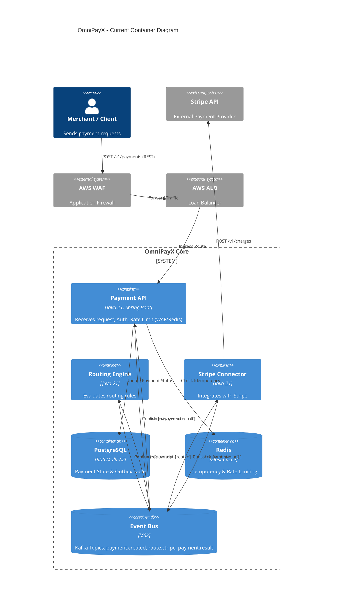

# Architecture: OmniPayX

## Actual Architecture (Current State)

## Spec vs Actual

| Component | Per README/02 | Actual in code | Reason for divergence |
|---|---|---|---|
| AWS Infrastructure | High-level Terraform modules | Raw AWS resources in Terraform | Preference for granular control and explicit understanding of the infrastructure components. |
| IAM Auth (Cognito/OAuth2) | Validate Token via IAM | Skipped/Mocked in API | To focus on Core Payment routing logic and infrastructure deployment within the roadmap timeframe. |
| CDC Engine (Debezium) | Debezium polling Outbox | Simplified Spring Scheduler | Kept within Java service bounds to reduce operational overhead for a portfolio project, while maintaining the Outbox Pattern concept. |
| PayPal Connector | Planned `paypal-connector` | Not implemented | Scope control. Stripe was sufficient to prove the routing and event-driven architecture. |

## Bounded Contexts & Module Boundaries

1. **Payment Core (`payment-api`):** Owns the `Payment` and `Transaction` entities. Strictly an edge service. It never calls downstream services synchronously. All cross-boundary communication is done by emitting `payment.created` and consuming `payment.result`.
2. **Routing (`routing-engine`):** A stateless rules engine that listens to payments and decides the destination. Entirely decoupled from the Edge and the Connectors.
3. **Gateway Integration (`stripe-connector`):** Responsible for translating internal domain events to Stripe API contracts. Implements its own retry policies and circuit breakers (Resilience4j).

## Known Gaps / Architectural TODOs

1. **Authentication:** OAuth2/JWT validation is currently a stub. A real Identity Provider (Cognito or Keycloak) needs to be integrated.
2. **Debezium Integration:** True CDC (Change Data Capture) via Debezium + Kafka Connect is needed to completely eliminate the Spring `@Scheduled` outbox polling and ensure strict exactly-once semantics.
3. **Multi-Region Active-Active:** Currently deployed in a single Region (us-east-1) across multiple AZs. Multi-region failover via Route53 and RDS Cross-Region Replication is documented but not fully provisioned in Terraform.
